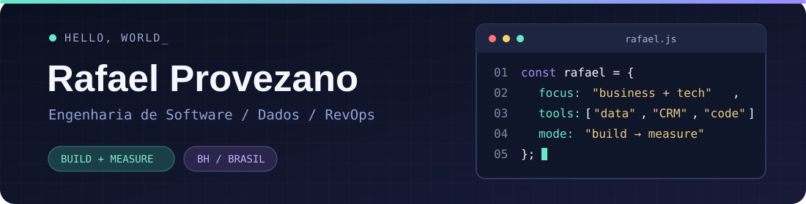

  

  
  

  

## 👾 Olá, eu sou o Rafael

Sou **analista de negócios e graduando em Engenharia de Software** em Belo Horizonte. Gosto de pegar problemas que começam em planilhas, processos ou conversas com clientes e transformá-los em **dados organizados, fluxos mensuráveis e ferramentas úteis**.

Hoje atuo na **GeoLabor** com desenvolvimento de negócios B2B, inteligência de mercado e CRM. Também trabalho com inteligência comercial na **One Big Media** e projetos de automação e CRM. Meu caminho passa por operações, dados e desenvolvimento — é nessa combinação que busco construir produtos e processos melhores.

> **Minha linha de código favorita:** entender o problema → organizar os dados → construir → medir → melhorar.

## 🧭 Main quest

- Estruturar operações comerciais e CRM com critérios claros, automações e indicadores.
- Usar dados para identificar oportunidades e apoiar decisões de produto e negócio.
- Evoluir projetos de software que resolvam problemas reais.

**Projeto em destaque:** [SIGBM Market Intelligence](https://github.com/Provezanovsky/sigbm-market-intelligence), aplicação web pública para explorar dados do SIGBM/ANM e transformar recortes de estruturas em análises e listas de qualificação. O repositório inclui código, documentação e link para a demonstração no GitHub Pages.

## 🧩 Projetos e experiências de construção

| Projeto | O que fiz / estou fazendo |
| --- | --- |
| **[SIGBM Market Intelligence](https://github.com/Provezanovsky/sigbm-market-intelligence)** | Aplicação web em **Next.js, React e TypeScript** com mapa, filtros combinados, indicadores, seleção de estruturas e exportação CSV. Trabalha com dados públicos e permite carregar novas bases localmente no navegador. |\n| **[QBank — API de contas bancárias](https://github.com/Provezanovsky/sistema-contas-bancarias-QBANK)** | Projeto acadêmico em equipe: API REST de contas em **Java, Spring Boot e H2**, com operações CRUD e separação em controller, service e repository. |
| **Veículo autônomo com IA** | Protótipo acadêmico com **NVIDIA Jetson Nano, Python, visão computacional e deep learning**. |
| **Aliança Universitária** | Participação em iniciativa de **inclusão digital e educação em tecnologia**. |

## 🛠️ Inventário

**Desenvolvimento**  
       

**Dados, CRM e operações**  
   

## 📖 Minha trajetória

| Período | Atuação |
| --- | --- |
| **2026 → hoje · GeoLabor** | Desenvolvimento de negócios para software B2B, inteligência de mercado, CRM e estratégias de contas. |
| **2025 → hoje · One Big Media** | Inteligência comercial, segmentação de leads, pipeline e análises para operações de prospecção. |
| **2024–2025 · Cargo Sapiens** | Estruturação de pré-vendas, ICP, HubSpot e indicadores; redesenho de workflows que reduziu em aproximadamente **40%** as etapas manuais mapeadas. |
| **2021–2024 · Qintess** | Suporte e automações administrativas com VBA; redução de aproximadamente **90%** no tempo de execução de rotinas específicas. |

**Formação:** Engenharia de Software na UniBH · **Idiomas:** português nativo e inglês avançado.

## 🎮 Side quests

Gosto de RPGs, jogos de aventura e mundos de fantasia. Fora do trabalho, continuo curioso sobre como dados, IA e software mudam a forma como vivemos e decidimos.

   
  Continuar? [Y/n]

Animações: <a href="https://commons.wikimedia.org/wiki/File:Animated_GNU_Bash_Unix_Shell_Prompt.gif">terminal</a> e <a href="https://commons.wikimedia.org/wiki/File:Retro_Arcade_Pixel_Art.gif">arcade</a>, disponíveis sob CC0.
